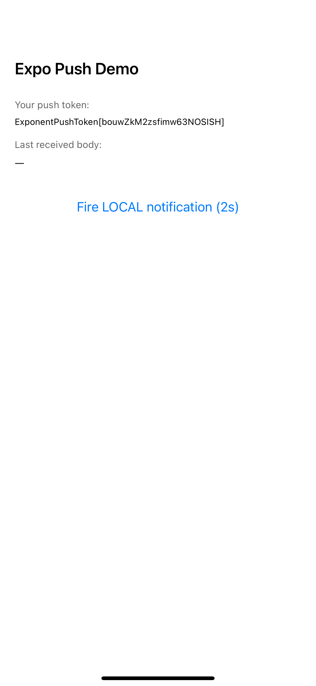
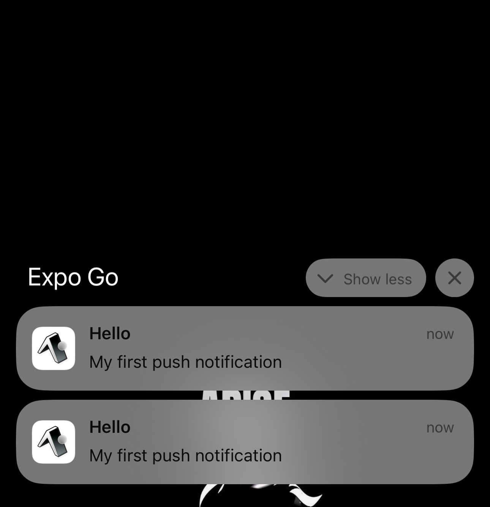

# Practical 4: Expo Push Notifications

---

## Aim

Implement a complete Expo Push Notification system in a React Native app from permission handling and token retrieval to sending notifications via a browser tool and a Node.js backend.

---

## Objectives

- Install and configure `expo-notifications`, `expo-device`, and `expo-constants`
- Set up an Expo account, initialise EAS, and obtain the project ID
- Configure `app.json` with the correct bundle identifier, Android package, and notifications plugin
- Request permissions, retrieve the push token, register listeners, and fire local notifications in `App.tsx`
- Build and deploy to a physical Android device using `npx expo run:android`
- Send and verify a test notification using the Expo Push Notification Tool

---

## Learning Outcomes

- Describe the full push notification flow: device → Expo Push Service → FCM/APNs → phone
- Tell apart an Expo Push Token, projectId, bundleIdentifier, and FCM credential
- Implement permission requests, Android notification channels, and token retrieval
- Register and clean up listeners correctly using React's `useEffect`
- Use development builds instead of Expo Go for native feature testing in SDK 53+

---

## Requirements

### Software

| Tool | Purpose |
|------|---------|
| Node.js 20 LTS | Runs Expo CLI and build tools |
| npm | Package manager |
| EAS CLI | Cloud builds and projectId setup |
| expo-notifications | Permissions, token retrieval, listeners |
| expo-device | Detects real device vs simulator |
| expo-constants | Reads projectId from `app.json` at runtime |

### Hardware

- A computer with internet access
- An Android phone with USB debugging enabled
- A USB data cable

---

## Procedure

### Step 1: Install System Tools

```bash
node -v && npm -v
npm install -g eas-cli
eas --version
```

### Step 2: Create the Expo Project

```bash
npx create-expo-app@latest PushDemo --template blank-typescript
cd PushDemo
```

### Step 3: Install Required Packages

```bash
npx expo install expo-notifications expo-device expo-constants
```

### Step 4: Create Expo Account and Get projectId

```bash
eas login
eas init
```

`eas init` registers the project on EAS and writes the `projectId` UUID into `app.json` automatically.

### Step 5: Configure `app.json`

```json
{
  "expo": {
    "name": "PushDemo",
    "slug": "push-demo",
    "ios": { "bundleIdentifier": "com.yourname.pushdemo" },
    "android": { "package": "com.yourname.pushdemo" },
    "plugins": [["expo-notifications", { "defaultChannel": "default" }]],
    "extra": { "eas": { "projectId": "abcd1234-..." } }
  }
}
```

### Step 6: Write App Code (`App.tsx`)

- `Notifications.setNotificationHandler()` placed at module scope to handle foreground behaviour including cold starts
- `registerForPushNotificationsAsync()` checks for a real device, creates the Android channel, requests permission, and calls `getExpoPushTokenAsync()`
- `useEffect` registers and cleans up foreground and tap-response listeners
- `fireLocalNotification()` schedules a local notification after 2 seconds for quick foreground testing

### Step 7: Build and Run on Android

```bash
npx expo run:android
```

First build takes around 10 minutes. Once installed, grant notification permission and the push token appears on screen:

```
ExponentPushToken[Xx9k5l-2nW1qABCDeFGHi]
```

### Step 8: Send a Test Notification

Open [expo.dev/notifications](https://expo.dev/notifications) and fill in:

| Field | Value |
|-------|-------|
| Expo Push Token | `ExponentPushToken[...]` |
| Title | Hello |
| Body | My first push notification |
| Data | `{"screen":"Home"}` |

The notification arrives on the lock screen within ~3 seconds. Tapping it triggers the response listener and shows the data payload.

---

## Code

Source code: [GitHub Repo](https://github.com/PhuntshoNamgyel/SS2026_SWE201_02240354.git)

---

## Output

**Figure 1: Home Screen**



**Figure 2: Notification Screen**



---

## Observations

- The push token is tied to the app installation. Uninstalling invalidates it, so backends must handle `DeviceNotRegistered` errors and remove stale tokens.
- SDK 53 dropped remote push support in Expo Go on Android. A development build is now required for end-to-end testing.
- The Android notification channel must be created before calling `getExpoPushTokenAsync()`.
- `sendPushNotificationsAsync()` returns tickets, not delivery receipts. Actual delivery status needs a follow-up call to `getPushNotificationReceiptsAsync()` around 15 minutes later.
- Some Android vendors (Xiaomi, Realme, OPPO) kill background processes aggressively. Setting battery mode to "No restrictions" is needed for reliable delivery.

---

## Problems Encountered

- **Expo Go did not receive remote notifications.** This turned out to be an SDK 53 restriction, not a code bug. Switching to a development build resolved it immediately.
- **"No projectId found" on first launch.** The build was run before `eas init` was called, so the field was missing from `app.json`. Running `eas init` and rebuilding fixed it.
- **Long initial build time.** The first Gradle build took around 12 minutes. Knowing that incremental builds are much faster (under 2 minutes) would have reduced the frustration.

---

## Conclusion

This practical covered the full lifecycle of a push notification: from requesting permission and registering a token on the client, to routing messages through the Expo Push Service and delivering them via FCM. Each layer has its own configuration requirements and a gap in any one of them breaks delivery entirely, which made debugging a useful exercise in understanding the system as a whole. Step 9 (Node.js backend) was not completed due to hardware constraints, but the core concepts around message formatting, chunking, and the ticket-receipt distinction were reviewed from the documentation.